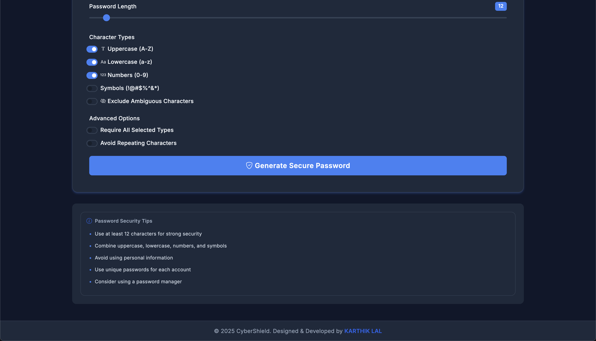

<div align="center">

  <h1>🔒 CyberShield</h1>
  <p><strong>Advanced Password Generator & Security Tool</strong></p>


[](https://passgen.karthiklal.in)

  <p align="center">
    <a href="#✨-features">Features</a> •
    <a href="#🚀-live-demo">Live Demo</a> •
    <a href="#💻-installation">Installation</a> •
    <a href="#🛠️-usage">Usage</a> •
    <a href="#🤝-contributing">Contributing</a>
  </p>

  

  

  
 
</div>

## ✨ Features

- 🔐 **Advanced Security**

  - Cryptographically secure random number generation
  - Multiple character sets for enhanced complexity
  - Password strength assessment in real-time

- 🎨 **Modern Interface**

  - Clean, intuitive user interface
  - Dark/Light theme support
  - Responsive design for all devices

- ⚙️ **Customization Options**

  - Password length (8-128 characters)
  - Character type selection
    - Uppercase letters (A-Z)
    - Lowercase letters (a-z)
    - Numbers (0-9)
    - Special characters (!@#$%^&\*)
  - Exclude ambiguous characters
  - Avoid character repetition

- 🔄 **Additional Features**
  - One-click copy to clipboard
  - Password strength indicator
  - Security recommendations
  - Cross-browser compatibility

## 🚀 Live Demo

Experience CyberShield in action: [https://passgen.karthiklal.in](https://passgen.karthiklal.in)

## 💻 Installation

### Quick Start

```bash
# Clone the repository
git clone https://github.com/karthik558/CyberShield-Password-Generator.git

# Navigate to project directory
cd CyberShield-Password-Generator

# Open in browser
# For Linux/macOS
open index.html

# For Windows
start index.html
```

## 🛠️ Usage

1. **Access the Generator**

   - Visit [https://passgen.karthiklal.in](https://passgen.karthiklal.in)
   - Or open `index.html` locally

2. **Configure Password Settings**

   - Set desired password length using the slider
   - Select character types to include
   - Enable/disable additional options

3. **Generate & Copy**
   - Click "Generate Password"
   - Use the copy button to copy to clipboard
   - Check password strength indicator

## 🤝 Contributing

We welcome contributions! Here's how you can help:

1. **Fork the Repository**

   ```bash
   git clone https://github.com/yourusername/CyberShield-Password-Generator.git
   ```

2. **Create a Branch**

   ```bash
   git checkout -b feature/SecurityRecommendations
   ```

3. **Make Changes**

   - Write clean, documented code
   - Follow existing code style
   - Add tests if applicable

4. **Test Your Changes**

   - Ensure the generator functions as expected
   - Verify the password strength indicator

5. **Submit a Pull Request**
   - Describe your changes in detail
   - Link any related issues

## 📝 License

Licensed under the MIT License - see the [LICENSE](LICENSE) file for details.

## 🌟 Acknowledgments

- Icons by [Bootstrap Icons](https://icons.getbootstrap.com/)
- Font by [Google Fonts](https://fonts.google.com/)
- Inspired by modern security practices

## 📊 Project Status

<div align="center">

**Current Version: 3.0.0**

| Feature           | Status |
| ----------------- | ------ |
| Core Generator    | ✅     |
| Password Strength | ✅     |
| Dark Mode         | ✅     |
| Mobile Support    | ✅     |
| PWA Support       | 🚧     |
| Browser Extension | 📅     |

</div>

---

<div align="center">
  
**⭐ Star us on GitHub — it motivates me a lot!**

[Report Bug](https://github.com/karthik558/password-generator/issues) •
[Request Feature](https://github.com/karthik558/password-generator/issues)

</div>
