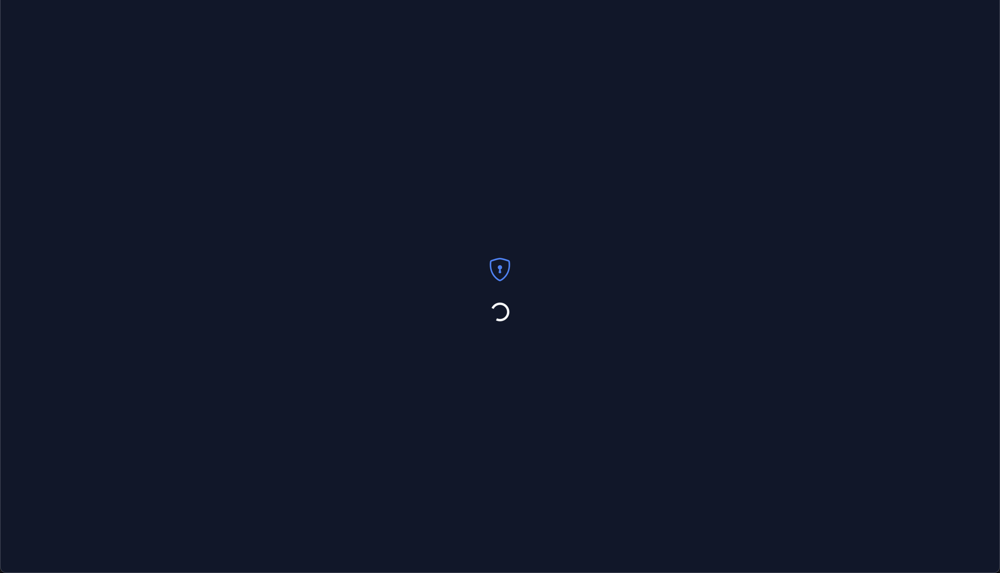
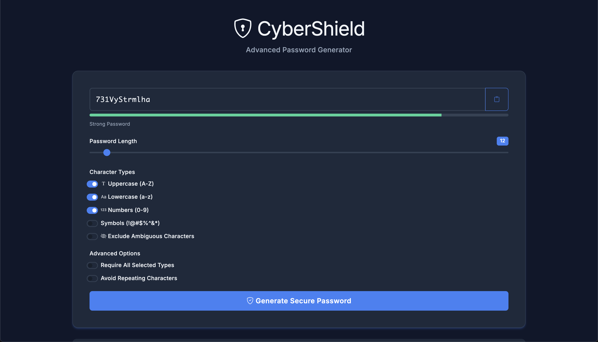

# <b> Password Generator </b>

## <b> Overview </b>

A secure and user-friendly password generator tool that helps you generate strong passwords for your online accounts. It allows you to customize your passwords by selecting options for uppercase letters, lowercase letters, numbers, and special characters. You can also choose the length of the password (between 8 and 128 characters) to create a unique and complex password that meets your requirements.

### <b> Features </b>

- Customizable options for generating passwords (uppercase letters, lowercase letters, numbers, and special characters)
- Ability to set password length between 8 and 128 characters
- Secure password generation algorithm that creates unique and complex passwords
- User-friendly interface that makes it easy to generate passwords quickly
- Cross-browser compatibility (works on all modern browsers)

### <b> Screenshots </b>

## <b> Installation </b>

To use the Password Generator Tool, simply visit the [Password Generator website](https://password-generator-karthik.netlify.app/) and follow the instructions to generate a new password. 

If you want to run the Password Generator Tool locally, follow these steps:

1. Clone the repository by running `git clone https://github.com/karthik558/password-generator.git` in your terminal
2. Navigate to the project directory by running `cd password-generator`
3. Open the `index.html` file in your preferred web browser

## <b> Usage </b>

To generate a password using the Password Generator Tool, follow these steps:

1. Go to the [Password Generator website](https://password-generator-karthik.netlify.app/)
2. Select the options for your desired password (uppercase letters, lowercase letters, numbers, and special characters)
3. Use the slider to select the length of your desired password (between 8 and 128 characters)
4. Click on the "Generate Password" button to generate a new password
5. Copy the generated password and use it for your account

## <b> Contributing </b>

Contributions to the Password Generator Tool are welcome and appreciated. To contribute to the project, please follow these steps:

1. Fork the repository by clicking on the "Fork" button in the top-right corner of the repository page
2. Clone your fork of the repository by running `git clone https://github.com/yourusername/password-generator.git`
3. Create a new branch for your feature or bug fix by running `git checkout -b my-new-feature`
4. Make changes to the code and test your changes locally
5. Commit your changes by running `git commit -am 'Add some feature'`
6. Push your changes to your fork of the repository by running `git push origin my-new-feature`
7. Create a new pull request by going to the repository page on GitHub and clicking on the "New pull request" button

## <b> License </b>

The Password Generator Tool is open source software licensed under the MIT license. See the [LICENSE](LICENSE) file for more information.
